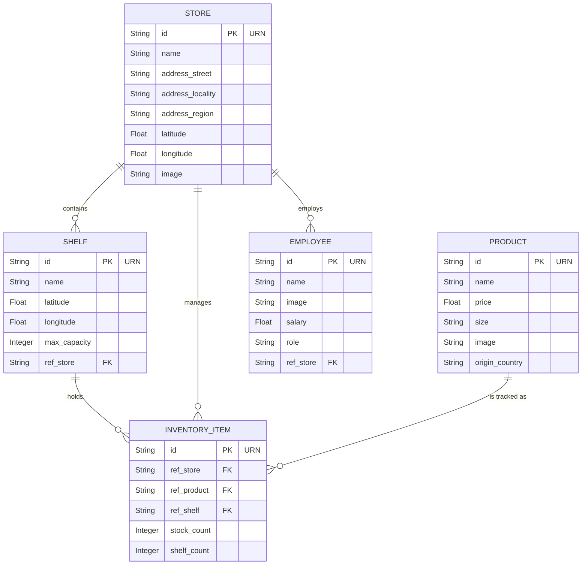

# Data Model

The application uses a relational data model with three specific tables to handle stores, products, and their relationships. A Many-to-Many architecture is employed allowing localized inventory tracking. Additionally, the system integrates with **FIWARE Orion Context Broker** for NGSIv2-compliant entity management.

_Note: Translation logic (Flask-Babel) handles UI strings only and relies on message catalogs (`.po` and `.mo` files), not the relational schema discussed here._

## Entity Relationship Diagram (ERD)

## Tables Details

### 1. `stores`

Represents a physical store location, aligned with the FIWARE Store model.

- `id` (String URN, PK): e.g., `urn:ngsi-ld:Store:001`.
- `name` (String): Display name.
- `address_street`, `address_locality`, `address_region` (String): Comprehensive address fields.
- `latitude`, `longitude` (Float): Geographic coordinates.
- `image` (String): URL to store photo.

### 2. `shelves`

Represents physical storage units within a specific store.

- `id` (String URN, PK): e.g., `urn:ngsi-ld:Shelf:001`.
- `name` (String): Unit name.
- `max_capacity` (Integer): Volume limit.
- `ref_store` (String URN, FK): Linked store.

### 3. `products`

Represents unique catalog items.

- `id` (String URN, PK): e.g., `urn:ngsi-ld:Product:001`.
- `name` (String): Item name.
- `price` (Float): Retail price.
- `size` (String): S/M/L/XL.
- `origin_country` (String): Product provenance.

### 4. `inventory_items`

Junction entity tracking stock across stores and specific shelves.

- `id` (String URN, PK): e.g., `urn:ngsi-ld:InventoryItem:001`.
- `ref_store`, `ref_product`, `ref_shelf` (String URN, FK): Relationship references.
- `stock_count` (Integer): Total units in store.
- `shelf_count` (Integer): Units currently on the specific shelf.

### 5. `employees`

Represents a staff member assigned to a store.

- `id` (String URN, PK): e.g., `urn:ngsi-ld:Employee:001`.
- `name` (String): Full name.
- `role` (String): Job title (e.g., Manager, Sales Associate).
- `salary` (Float): Annual salary.
- `image` (String): URL to profile photo.
- `ref_store` (String URN, FK): Store where the employee works.

## Testing Considerations

- **Integrity:** The `InventoryItem` and `Employee` relationships include a cascade delete on the `Store` relationship, meaning deleting a store automatically removes its inventory records and staff records. This is verified by the test suite.
- **In-Memory Testing:** All models are compatible with in-memory SQLite for rapid automated testing without side effects on the development database.
- **CRUD Validation:** The models support full CRUD operations via the web interface, ensuring that URN generation and reference integrity are maintained when adding, editing, or deleting entities through the frontend modals.
