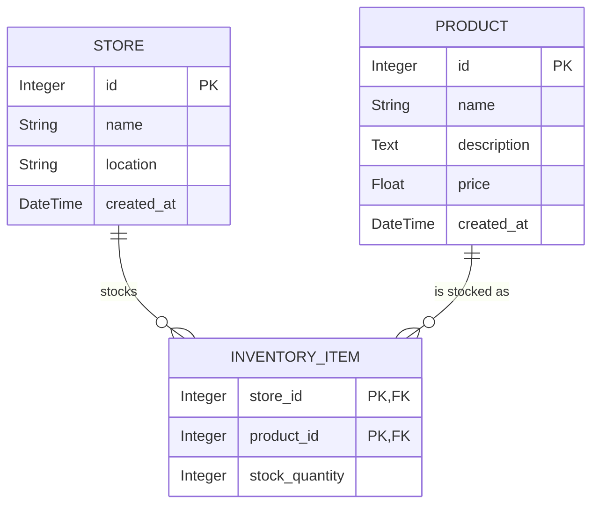

# Data Model

The application uses a relational data model with three specific tables to handle stores, products, and their relationships. A Many-to-Many architecture is employed allowing localized inventory tracking.

_Note: Translation logic (Flask-Babel) handles UI strings only and relies on message catalogs (`.po` and `.mo` files), not the relational schema discussed here._

## Entity Relationship Diagram (ERD)

## Tables Details

### 1. `stores`

Represents a physical store location within the chain.

- `id` (Integer, Primary Key): Unique identifier for the store.
- `name` (String, max 100 chars): Display name of the store.
- `location` (String, max 200 chars): Physical address or generic location.
- `created_at` (DateTime): Timestamp of when the store was added to the system.

### 2. `products`

Represents a unique sellable item in the master catalog.

- `id` (Integer, Primary Key): Unique identifier for the product.
- `name` (String, max 100 chars): Display name of the product.
- `description` (Text, optional): Detailed information about the product.
- `price` (Float): Base price of the product.
- `created_at` (DateTime): Timestamp of when the product was added to the catalog.

### 3. `inventory_items` (Junction Table)

Serves as an associative entity to resolve the Many-to-Many relationship between `stores` and `products`. It tracks _how many_ of a specific product exist at a specific store.

- `store_id` (Integer, Primary Key, Foreign Key): Reference to the `stores.id`.
- `product_id` (Integer, Primary Key, Foreign Key): Reference to the `products.id`.
- `stock_quantity` (Integer): The current count of the product available at that specific store location. Default `0`.

## Testing Considerations

- **Integrity:** The `InventoryItem` relationship includes a cascade delete on the `Store` relationship, meaning deleting a store automatically removes its inventory records. This is verified by the test suite.
- **In-Memory Testing:** All models are compatible with in-memory SQLite for rapid automated testing without side effects on the development database.
